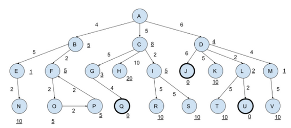
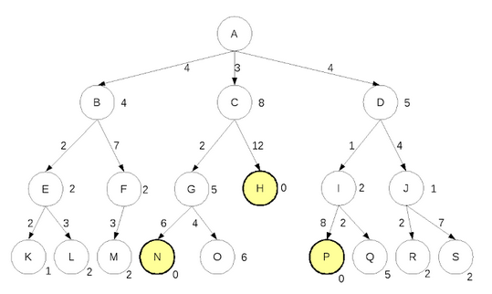
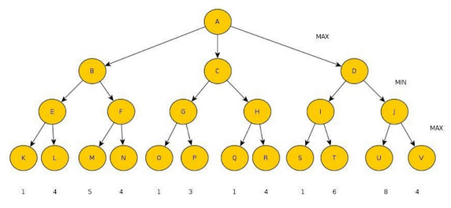

- Agente que aprende:
	- Além dos módulos de aprendizado, possui todos os módulos do agente com função de utilidade: Verdadeiro
	- Não pode ser utilizado em ambientes cujas as regras mudam: Falso - Ele é feito para ambientes onde as regras mudam
	- Possui um módulo que gera problemas: Verdadeiro
	- É preciso alterar a base de conhecimento: Verdadeiro - Pois ele aprende
- Seja um agente que joga ping-pong no mundo real. Em relação ao ambiente dele podemos afirmar que é:
	- Não Acessível: Pois você não sabe todas as informações
	- Estocástico: Próximo estado é aleatório
	- Não Episódico: O estado depende das raquetadas
	- Dinâmico: Eventos acontecem enquanto pensa
	- Contínuo: Infinidade de possibilidades de posição da pessoa e da bolinha
- Seja um agente que joga Damas no mundo real. Em relação ao ambiente dele podemos afirmar que é:
	- Acessível: Tem todas as informações do tabuleiro
	- Determinista: Próximo estado depende da sua ação
	- Não Episódico:
	- Estático: Enquanto pensa o tabuleiro fica parado
	- Discreto: Número finito de possibilidades para o tabuleiro
- Seja o seguinte grafo, sendo que o valor nas aresta corresponde ao valor do custo real g() e o valor junto aos nós corresponde ao valor estimado h(). O nó A é o estado inicial e os nós Q, J e U são os nós objetivos. Qual é a solução retornada na busca em amplitude?
	- 
	- A solução mais rasa é a descoberta primeiro
- Seja o seguinte grafo, sendo que o valor nas aresta corresponde ao valor do custo real g() e o valor junto aos nós corresponde ao valor estimado h(). O nó A é o estado inicial e os nós Q, J e U são os nós objetivos. Qual é a solução retornada na busca em profundidade à esquerda? (Nota: B é o primeiro nó à esquerda)
	- 
	- Não retorna solução (entra em loop em F - O - P)
- Seja o seguinte grafo, sendo que o valor nas aresta corresponde ao valor do custo real g() e o valor junto aos nós corresponde ao valor estimado h(). O nó A é o estado inicial e os nós N, H e P os nós objetivos. Qual é a solução retornada pela subida da encosta?
	- 
	- Retorna quando nenhum melhora
- Seja o seguinte grafo, sendo que o valor nas aresta corresponde ao valor do custo real g() e o valor junto aos nós corresponde ao valor estimado h(). O nó A é o estado inicial e os nós N, H e P os nós objetivos.Qual é a solução retornada na busca em profundidade iterativa à esquerda?
	- 
	- Retorna H pois vai por nivel
- Seja o seguinte grafo, sendo que o valor nas aresta corresponde ao valor do custo real g() e o valor junto aos nós corresponde ao valor estimado h(). O nó A é o estado inicial e os nós N, H e P os nós objetivos.Qual é a solução retornada na busca A*?
	- 
	- Pega o nó com G menor
	- N
- Seja o seguinte grafo, sendo que o valor nas aresta corresponde ao valor do custo real g() e o valor junto aos nós corresponde ao valor estimado h(). O nó A é o estado inicial e os nós N, H e P os nós objetivos.Qual é a solução retornada na busca Gulosa?
	- 
	- Ao contrário da subida da encosta, ele retorna solução válida
	- Retorna P
- Seja a árvore minimax abaixo. Indique qual será a jogada selecionada e o valor da jogada. Liste os nós que não seriam visitados caso utilizássemos corte alfa-beta.
	- 
	- Jogada D, valor 6. Nós não visitados
- O que é verdadeiro afirmar sobre o algoritmo guloso?
	- O algoritmo guloso mantém uma lista de nós abertos, podendo explorá-los se se tornarem interessantes: Verdadeiro
	- Pode não retornar uma resposta, mesmo se ela existir: Verdadeiro
	- Escolhe o nó cuja a avaliação foi a mais promissora: Verdadeiro
	- No pior caso possui custo de armazenamento exponencial: Verdadeiro
- O que é verdadeiro afirmar sobre a têmpera simulada?
	- A medida que o tempo passa a probabilidade de escolher nós que não são melhores que o corrente aumenta: Falso - Diminui
	- As escolhas iniciais possuem um componente de aleatoriedade: Verdadeiro
	- O comportamento final se assemelha a uma busca tipo subida da encosta: Verdadeiro
	- O comportamento final se assemelha a uma busca gulosa: Falso
	- É uma combinação de algoritmo genético com A*: Falso
- Seja g o custo até a solução e h a heurística. Marque os itens que representam uma heurística admissível.
	- Onde o h nunca ultrapassa o g
- Dado um problema de busca, cuja solução não é muito profunda, mas o fator de ramificação é alto, existe loop no grafo, não existe informação heurística e a memória disponível é pouca, indique o método de solução mais adequado.
	- fator de ramificação é alto: descarta amplitude
	- loop no grafo: descarta profundidade
	- não existe informação heurística: descarta A* e Guloso
	- Resposta: Iterativa
-